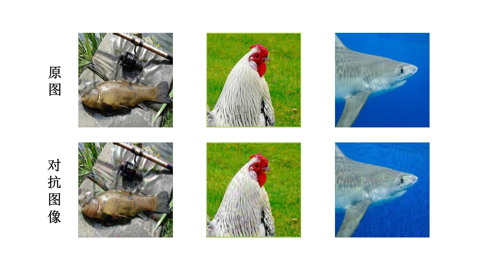

# transfer_adv
CVPR-2021 AIC-VI: unrestricted Adversarial Attacks on ImageNet

[CVPR2021 安全AI挑战者计划第六期赛道2：ImageNet无限制对抗攻击](https://s.alibaba.com/challenge)

## 介绍 ： ##

深度神经网络已经在各种视觉识别问题上取得了最先进的性能。尽管取得了极大成功，深度模型的安全问题也在业内引起了不少担忧，举例来说，深度神经网络很容易遭受输入上微小和不可察觉的干扰导致的误分类（这些输入也被称作对抗样本）。除了对抗样本，在实际场景中，深度模型遇到的更多威胁来自于非限制扰动对抗样本，即攻击者在图像上进行大范围且可见的修改，使得模型误识别的同时不影响人的正常观察。无限制对抗攻击是近两年来对抗领域的一个热门方向，希望通过此次比赛不仅可以让参赛选手了解和探索ImageNet上的无限制对抗攻击场景，还可以进一步提炼并总结无限制攻击的一些创新而有效的方案，在学术上推动对抗攻击领域的发展。

在ImageNet分类任务上，近年来出现了多种评测模型在不同场景下鲁棒性的衍生数据集（例如ImageNet-C，ImageNet-A，ImageNet-Sketch，ImageNet-R等），这些数据集都没有限制改动图像和原图之间的相似性，而是要求攻击图像更贴近现实世界存在的噪声（实际中常常发生的图像corruption，或者out of distribution现象）。本次比赛旨在探究更贴近实际且攻击性更强的生成无限制对抗扰动的方式。同时通过多种无限制攻击测试帮助理解当前深度模型脆弱之处并构建更鲁棒的分类服务。

思路：我们采用了**黑盒迁移性攻击策略**，通过对替代模型得攻击，完成对线上模型的攻击

涉及技术：MI, TI, DI, Gaussian smoothing，FGSM等

比赛排名：初赛 **TOP3** , 复赛**TOP10**, 决赛**TOP4**

具体涨分细节请参考：https://tianchi.aliyun.com/competition/entrance/531853/forum

该项目需要创建以下文件夹：

## transfer_adv 

​		- inputdata\

​				-—images/*.jpg

​				-—dev.csv

​		- results\

## 攻击效果图： ##

